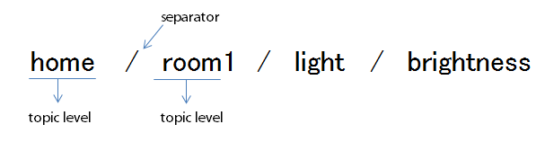
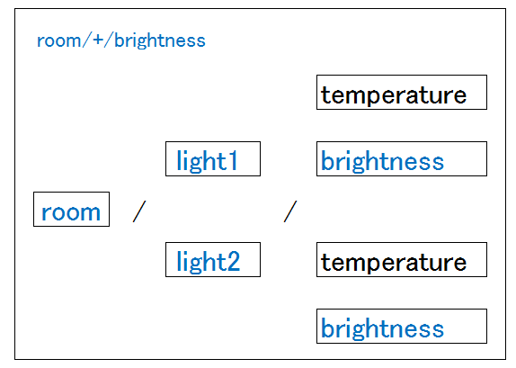
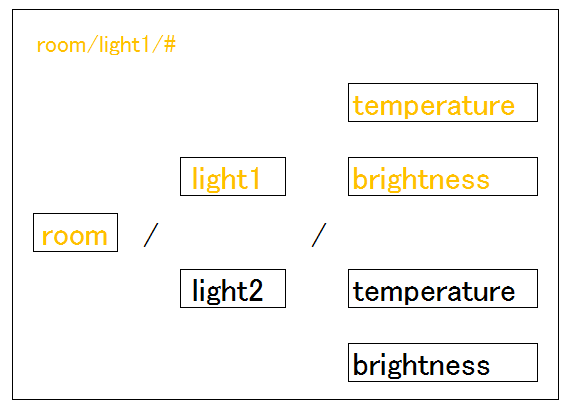
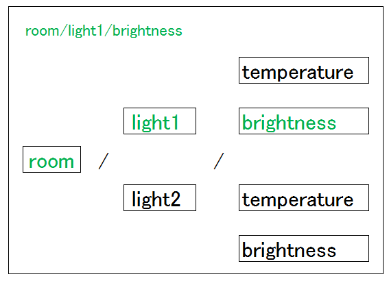
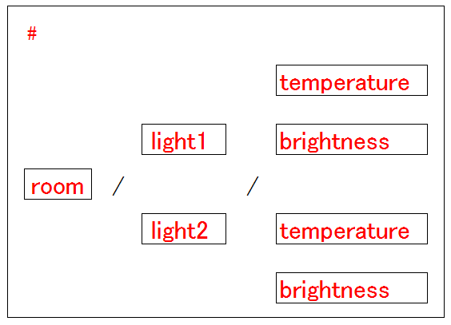
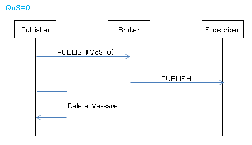
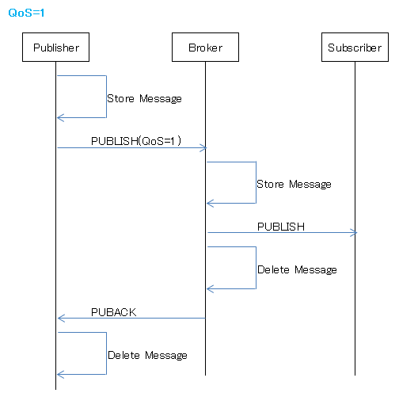
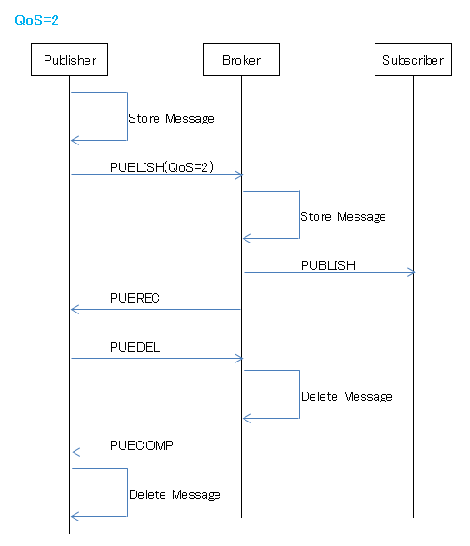
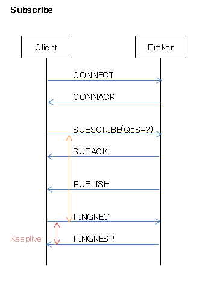
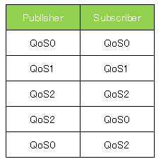

[文档资料](https://www.iteye.com/blogs/subjects/mqtt)

[MQTT官网](http://mqtt.org/software)

## 简介
    MQTT（MQ Telemetry Transport）消息队列遥测传输协议
    是TCP / IP协议之上，基于发布Publish/订阅Subscribe模式，机器到机器（M2M）通信，二进制传输的轻量级消息协议。1999年IBM开发，2010年对外免费开放，2014年正式成为OASIS的官方标准。
    虽然名称里有MQ，但它不是Message Queue，它并不会保证消息的顺序。
    和 RabbitMQ 相比：考虑在低带宽、不可靠的4G/LTE网络上运行（可靠性），多用于IoT、M2M、IM。
    和 HTTP 相比：通信量减少（低带宽）、设备耗电量减少（低功耗）、支持消息推送、Pub/Sub模型，双向1对多/多对多通信等。
    MQTT最小的packet大小是只有2个字节的header。 
    目前百度、阿里、腾讯、京东、移动等都有物联网平台，而MQTT是物联网中相当重要的角色。
    物联网环境下，大量的device或sensor需要将很小的数据定期发送出去，并接受外部传回来的数据。这样的数据交换是大量存在的。
    MQTT通过Broker转发消息，所以可以穿透NAT，类似的协议还有AMQP、XMPP等。
    MQTT协议里面是按照设备一直在线设计的，数据都是保存在内存里的，所以MQTT是比较吃内存的。 

#### HTTP、MQTT、Websocket、WebService有什么区别
    相同点：HTTP、MQTT、Websocket均为OSI 7层模型的【应用层协议】
    注意. WebService并非通信协议，而是一种远程接口调用（RPC）的框架技术。
    不同点：如下
___

#### MQTT

2.MQTT特性

MQTT协议是为大量计算能力有限，且工作在低带宽、不可靠的网络的远程传感器和控制设备通讯而设计的协议，它具有以下主要的几项特性：

    使用发布/订阅消息模式，提供一对多的消息发布，解除应用程序耦合；
    对负载内容屏蔽的消息传输；
    使用 TCP/IP 提供网络连接；
    有三种消息发布服务质量：
        “至多一次”，消息发布完全依赖底层 TCP/IP 网络。会发生消息丢失或重复。这一级别可用于如下情况，环境传感器数据，丢失一次读记录无所谓，因为不久后还会有第二次发送。
        “至少一次”，确保消息到达，但消息重复可能会发生。
        “只有一次”，确保消息到达一次。这一级别可用于如下情况，在计费系统中，消息重复或丢失会导致不正确的结果。
    数据传输和协议交换的最小化（协议头部只有2字节），以减少网络流量
    通知机制，异常中断时通知传输双方
    使用 Last Will 和 Testament 特性通知有关各方客户端异常中断的机制；
2.1 MQTT协议的组成

实现MQTT协议需要：客户端和服务器端
MQTT协议中有三种身份：发布者（Publish）、代理（Broker）（服务器）、订阅者（Subscribe）。其中，消息的发布者和订阅者都是客户端，消息代理是服务器，消息发布者可以同时是订阅者。
MQTT传输的消息分为：主题（Topic）和负载（payload）两部分

    Topic，可以理解为消息的类型，订阅者订阅（Subscribe）后，就会收到该主题的消息内容（payload）
    payload，可以理解为消息的内容，是指订阅者具体要使用的内容
2.2 网络传输与应用消息

MQTT会构建底层网络传输：它将建立客户端到服务器的连接，提供两者之间的一个有序的、无损的、基于字节流的双向传输。
当应用数据通过MQTT网络发送时，MQTT会把与之相关的服务质量（QoS）和主题名（Topic）相关连。

2.3 MQTT客户端

一个使用MQTT协议的应用程序或者设备，它总是建立到服务器的网络连接。客户端可以：

    发布其他客户端可能会订阅的信息
    订阅其它客户端发布的消息
    退订或删除应用程序的消息
    断开与服务器连接

 
2.4 MQTT服务器

MQTT服务器以称为“消息代理”（Broker），可以是一个应用程序或一台设备。它是位于消息发布者和订阅者之间，它可以：

    接受来自客户的网络连接
    接受客户发布的应用信息
    处理来自客户端的订阅和退订请求
    向订阅的客户转发应用程序消息
    
___

#### 各大通讯方式的比较
HTTP

HTTP是一个属于应用层的，基于TCP/IP通信协议来传递数据（HTML 文件, 图片文件, 查询结果等）。

通信方式

    浏览器作为HTTP客户端通过URL向HTTP服务端即WEB服务器发送请求。Web服务器根据接收到的请求后，向客户端发送响应信息。
    HTTP之请求消息Request：请求行（request line）、请求头部（header）、空行和请求数据四个部分组成。
    HTTP之响应消息Response：HTTP响应也由四个部分组成，分别是：状态行、消息报头、空行和响应正文。
    若connection 模式为close，则服务器会主动关闭TCP连接，客户端被动关闭连接，释放TCP连接;若connection 模式为keepalive，则该连接会保持一段时间，在该时间内可以继续接收请求;

不足：

    HTTP通信方式问题，HTTP的请求/应答方式的会话都是客户端发起的，缺乏服务器通知客户端的机制，在需要通知的场景，如聊天室，游戏，客户端应用需要不断地轮询服务器。

Websocket协议（非socket）

    WebSocket协议是基于TCP的一种应用层网络协议。它实现了浏览器与服务器全双工(full-duplex)通信——允许服务器主动发送信息给客户端。
    取代了网页和服务器采用HTTP轮询进行双向通讯的机制。

WebService：RPC框架的一种

    XML+XSD,SOAP和WSDL就是构成WebService平台的三大技术。
    1）XML+XSD
    1.1）WebService采用HTTP协议传输数据，采用XML格式封装数据（即XML中说明调用远程服务对象的哪个方法，传递的参数是什么，以及服务对象的 返回结果是什么）。XML是WebService平台中表示数据的格式。除了易于建立和易于分析外，XML主要的优点在于它既是平台无关的，又是厂商无关 的。无关性是比技术优越性更重要的：软件厂商是不会选择一个由竞争对手所发明的技术的。
    1.2）XML解决了数据表示的问题，但它没有定义一套标准的数据类型，更没有说怎么去扩展这套数据类型。例如，整形数到底代表什么？16位，32位，64位？这 些细节对实现互操作性很重要。XML Schema(XSD)就是专门解决这个问题的一套标准。它定义了一套标准的数据类型，并给出了一种语言来扩展这套数据类型。WebService平台就 是用XSD来作为其数据类型系统的。当你用某种语言(如VB.NET或C#)来构造一个Web service时，为了符合WebService标准，所 有你使用的数据类型都必须被转换为XSD类型。你用的工具可能已经自动帮你完成了这个转换，但你很可能会根据你的需要修改一下转换过程。
    2）SOAP
    2.1） WebService通过HTTP协议发送请求和接收结果时，发送的请求内容和结果内容都采用XML格式封装，并增加了一些特定的HTTP消息头，以说明 HTTP消息的内容格式，这些特定的HTTP消息头和XML内容格式就是SOAP协议。SOAP提供了标准的RPC方法来调用Web Service。
    2.2）SOAP协议 = HTTP协议 + XML数据格式
    SOAP协议定义了SOAP消息的格式，SOAP协议是基于HTTP协议的，SOAP也是基于XML和XSD的，XML是SOAP的数据编码方式。打个比 喻：HTTP就是普通公路，XML就是中间的绿色隔离带和两边的防护栏，SOAP就是普通公路经过加隔离带和防护栏改造过的高速公路。
    3）WSDL

___
### MQTT 协议
[MQTT协议中文版.gitbooks](https://mcxiaoke.gitbooks.io/mqtt-cn/content/mqtt/01-Introduction.html)

[MQTT协议中文版.pdf](mqtt-cn.pdf)

1.**Topic**

MQTT是基于topic来发布消息的，发布者在发布消息时需要指定该消息发布在哪个topic下。

topic最容易的理解方式是文件夹路径。如果有成千上万的不同类型的文件要保存，为了合理放置这些文件，需要创建一系列有层次性的文件夹来管理它们。发布消息就好比把文件保存到不同的文件夹下。
和文件夹类似，topic有主题级别，各级别之间是以斜杠(/)来分隔的。

比如： usr/home/room1/light/brightness 就有5个级别。

    第1层：用户
    第2层：场所
    第3层：位置
    第4层：物件
    第5层：数据指标 
    

(1) topic名是大小写敏感的。

比如以下四个是分别不同的主题：

    room1/light/brightness
    room1/Light/brightness
    Room1/light/brightness
    Room1/Light/Brightness
    
(2) topic名中的每个主题级别可以使用任何UTF-8字符。

(3) 尽可能避免使用美元符$开头。

因为一般MQTT服务器都会使用$开头的topic存储统计信息。

    比如：$SYS主题
    用于存贮Broker的运行信息，只读topic不能往里publish消息。
    $SYS主题有很多，具体可以参考：
    http://mosquitto.org/man/mosquitto-8.html
    https://github.com/mqtt/mqtt.github.io/wiki/SYS-Topics
    
(4) 通配符：+、#

基于主题的消息过滤，可以使用通配符来订阅多个主题的消息。

但是发布消息时，不可以使用通配符，必须指定完整的topic名，如果想发送给多个topic，需要发布多次。

加号+：单层匹配
 

井号#：多层匹配，多用于前方一致的匹配

准确匹配一个topic：

匹配所有topic：

2.**服务质量QoS**

为了确保客户端和服务器端之间消息的送达，MQTT支持三种消息发布服务质量(QoS：Quality of Service)：

    （1）QoS 0(At most once)“至多一次”
    消息发布完全依赖底层 TCP/IP 网络。会发生消息丢失或重复。这一级别可用于如下情况，环境传感器数据，丢失一次读记录无所谓，因为不久后还会有第二次发送。
    
    （2）QoS 1(At least once)“至少一次”
    确保消息到达，但消息重复可能会发生。
    
    （3）QoS 2(Exactly once)“只有一次”
    确保消息到达一次。这一级别可用于如下情况，在计费系统中，消息重复或丢失会导致不正确的结果。小型传输，开销很小（固定长度的头部是 2 字节），协议交换最小化，以降低网络流量。

需要*注意*的是：

    这里指的是Client和Broker之间的关系，而不是Publisher和Subscriber之间的关系，在Pub/Sub模型中，Publisher和Subscriber是完全解耦的。
    发布者在每次发布消息时都需要设置QoS，订阅者在订阅主题时也可以设置QoS。
    发布者或者订阅者设置的QoS分别是和服务器端异步执行的。
    即使发布者设置发布消息为QoS2，订阅者也可以通过QoS0或QoS1来订阅该消息（这样就是QoS的降级downgrade）。
    ~~订阅者一般来说最好使用QoS2。~~

以下是发布和订阅的时序图：

通信抓包具体看看每种QoS的通信过程。 

3.**保留消息和最后遗嘱** 

(1) 保留消息Retained Messages

MQTT中，无论是发布还是订阅都不会有任何触发事件。

    1个Topic只有唯一的retain消息，Broker会保存每个Topic的最后一条retain消息。
    每个Client订阅Topic后会立即读取到retain消息，不必要等待发送。
    订阅Topic时可以使用通配符，就会收到匹配的每个Topic的retain消息。

    发布消息时把retain设置为true，即为保留信息。
    如果需要删除retain消息，可以发布一个空的retain消息，因为每个新的retain消息都会覆盖最后一个retain消息。

主要应用：

    1）如果订阅者无法和Broker连接，可以通过retain消息让订阅者在下次成功连接时一次性接收所有的内容
    2）发布者定时发布retain消息，订阅者获取该信息后能推测发布者的状态（last good value）

(2) 最后遗嘱LWT（Last Will & Testament）

MQTT本身就是为信号不稳定的网络设计的，所以难免一些客户端会无故的和Broker断开连接。

    当客户端连接到Broker时，可以指定LWT，Broker会定期检测客户端是否有异常。
    当客户端异常掉线时，Broker就往连接时指定的topic里推送当时指定的LWT消息。

LWT的相关信息在连接时可以设置：
Python代码  收藏代码

    client = mqtt.Client()  
    client.will_set('test/rensanning/will', 'Last will message', 0, False)  
    client.connect('localhost', 1883)  

LWT经常和保留消息一起使用，把每个客户端的状态保存到一个Topic下。
比如：可以在 client1/status 里保存online或者offline的信息。

正常 client.disconnect() 放开，就接收不到LWT了。 

4.**连接和会话** 

(1) Connection

连接指的是client和broker之间，client和client之间不能直接连接。
client和broker之间建立连接，必须先发送一个 CONNECT 消息，并附带上必要的认证信息。broker接收到 CONNECT 之后，会执行认证等处理,应答一个 CONNACK 消息。
连接一旦建立，broker会为client保持这个连接，直到客户端发起disconnect。

虽然client一般都是在router之下的局域网中，但client发起 CONNECT 给broker后，broker会保持该连接，所以**MQTT是可以穿透NAT的**。

CONNECT消息

    ClientId：broker内部唯一标示客户端的ID（CleanSession为true时可为空）
    CleanSession：标示client和broker之间是否需要建立持久连接（CleanSession为false表示持久连接）
    Username/Password：客户端验证（平文传输）
    WillMessage：遗嘱消息
    KeepAlive：客户端发起PING Request的时间间隔，确保连接正常。 

需要注意的是，ClientId, WillMessage, Username/Password 这三项内容是存在 CONNECT 消息的

(2) Session

Session分为以下两种：

    a）Persistent Session
    broker 会存储订阅消息或未转发消息，为了给client存储信息需要指定ClientId。
    如果CleanSession为false但没有指定ClientId是无法连接到broker的。
    
    b）Clean Session
    broker 不会存储任何订阅消息或未转发消息，适用于只publish的客户端。

当一个client连接到broker时，broker会为其创建一个session。
这个session相关信息将会同时保存在broker和client中。

session里包含以下内容：

    客户端的订阅信息
    从broker接收来的还没有ack的消息
    发送给client的还没有ack的消息 

client意外中断后发起重连broker，如果是持久session，client能够立即再获取到未接收到的消息。
client和broker之间的连接可以通过设置不同的clean_session来变更。
client可以是 Publisher 或者是 Subscriber 或者同时两者都是。

